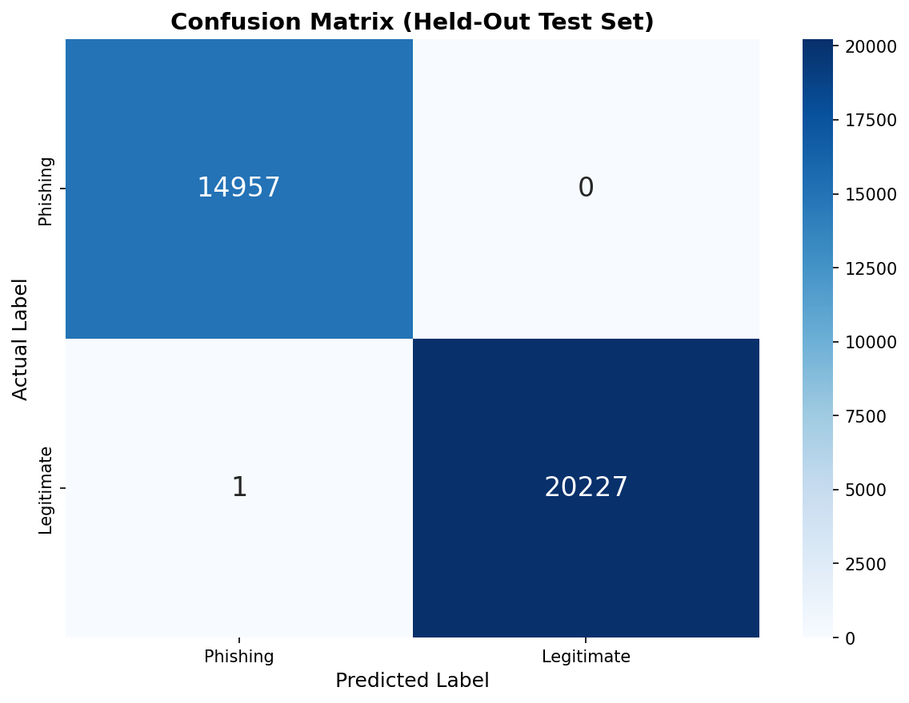
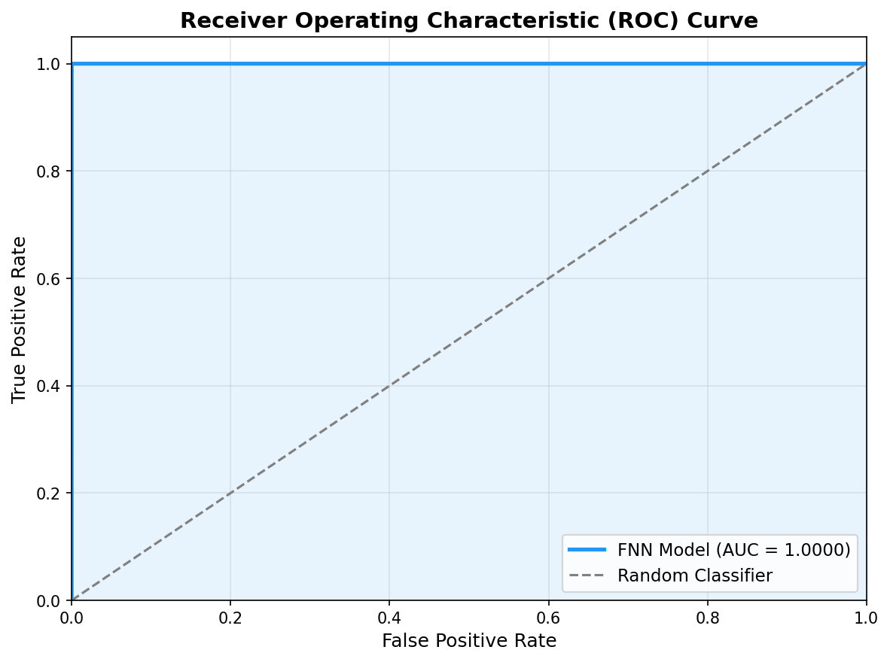
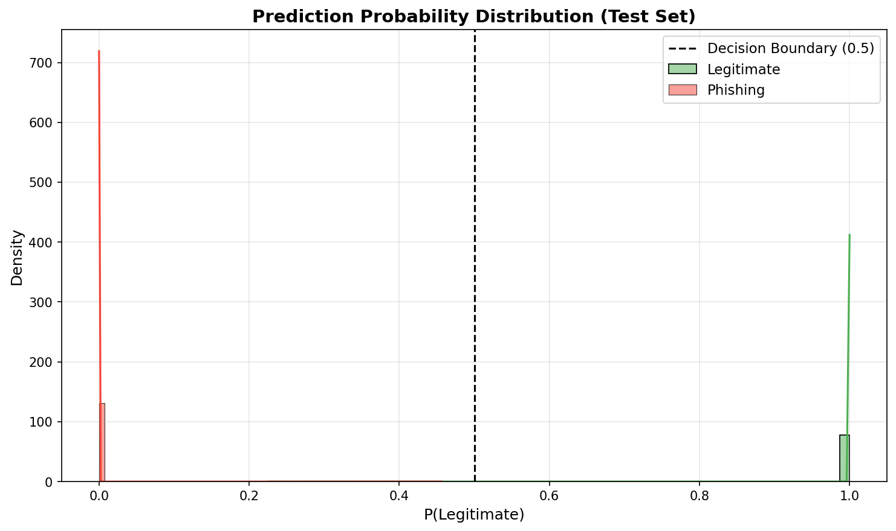

# Final Validation Report

## IEEE-Based Phishing Website Detection System

**Date:** August 4, 2026

---

## 1. Project Overview

This project implements a phishing website detection system based on the PHIUSIIL dataset. The system uses a Feedforward Neural Network (FNN) trained on 20 selected features from both URL structure and HTML content analysis. The pipeline integrates real-time webpage extraction using Playwright and BeautifulSoup, combined with DNS/WHOIS-based URL feature extraction.

## 2. Architecture Summary

```
URL Input
    |
    v
+-------------------+     +---------------------+
| URL Feature       |     | HTML Feature        |
| Extractor         |     | Extractor           |
| (101 features)    |     | (36 features)       |
+-------------------+     +---------------------+
    |                         |
    v                         v
+------------------------------------------+
| UnifiedFeaturePipeline                   |
| - Playwright browser automation          |
| - BeautifulSoup HTML parsing             |
| - Brand alias matching                   |
+------------------------------------------+
                    |
                    v
+------------------------------------------+
| Feature Alias Mapping (Top 20 Selection) |
+------------------------------------------+
                    |
                    v
+------------------------------------------+
| StandardScaler -> FNN Model              |
| (fnn_phase2_v2.keras)                    |
+------------------------------------------+
                    |
                    v
           Prediction Output
```

## 3. Dataset Information

| Property | Value |
|----------|-------|
| Source Dataset | PHIUSIIL Phishing URL Dataset |
| Test Split Size | 35185 samples |
| Legitimate Samples (Test) | 20228 |
| Phishing Samples (Test) | 14957 |
| Feature Count (URL) | 101 |
| Feature Count (HTML) | 36 |
| Top-20 Selected Features | 20 |
| Split Strategy | Train/Validation/Test |

## 4. Evaluation Metrics

Evaluated on the **held-out test split** (`data/processed_v2/test.csv`).

| Metric | Value |
|--------|-------|
| Accuracy | 0.999972 |
| Precision | 1.0 |
| Recall | 0.999951 |
| F1 Score | 0.999975 |
| ROC AUC | 1.0 |
| False Positive Rate | 0.0 |
| False Negative Rate | 4.9e-05 |

### Classification Report

```
              precision    recall  f1-score   support

    Phishing       1.00      1.00      1.00     14957
  Legitimate       1.00      1.00      1.00     20228

    accuracy                           1.00     35185
   macro avg       1.00      1.00      1.00     35185
weighted avg       1.00      1.00      1.00     35185
```

## 5. Confusion Matrix

| | Predicted Phishing | Predicted Legitimate |
|---|---|---|
| **Actual Phishing** | TN = 14957 | FP = 0 |
| **Actual Legitimate** | FN = 1 | TP = 20227 |



## 6. ROC Curve

**AUC Score:** 1.0



## 7. Probability Distribution



## 8. Feature Analysis

### Top 20 Features: Legitimate vs Phishing Mean Values

| Feature | Legitimate Mean | Phishing Mean | Difference |
|---------|----------------|--------------|------------|
| LargestLineLength | 7354.3773 | 19127.4534 | -11773.0761 |
| LineOfCode | 1910.9658 | 63.8372 | 1847.1286 |
| NoOfSelfRef | 113.0828 | 0.4883 | 112.5945 |
| NoOfExternalRef | 85.1259 | 1.1203 | 84.0056 |
| DomainTitleMatchScore | 75.5275 | 16.9906 | 58.5369 |
| URLSimilarityIndex | 100.0 | 49.4109 | 50.5891 |
| NoOfImage | 45.9522 | 0.8542 | 45.098 |
| URLLength | 26.2596 | 46.4764 | -20.2168 |
| NoOfJS | 17.6664 | 0.8777 | 16.7887 |
| NoOfCSS | 10.5877 | 0.4356 | 10.1521 |
| NoOfDegitsInURL | 0.0472 | 4.557 | -4.5098 |
| NoOfOtherSpecialCharsInURL | 1.2403 | 3.8502 | -2.6099 |
| HasSocialNet | 0.7923 | 0.0054 | 0.7869 |
| HasCopyrightInfo | 0.8062 | 0.0586 | 0.7476 |
| HasDescription | 0.733 | 0.0462 | 0.6868 |
| HasSubmitButton | 0.6594 | 0.087 | 0.5724 |
| IsResponsive | 0.8558 | 0.3102 | 0.5456 |
| IsHTTPS | 1.0 | 0.4919 | 0.5081 |
| DegitRatioInURL | 0.002 | 0.0658 | -0.0638 |
| SpacialCharRatioInURL | 0.0482 | 0.0833 | -0.0351 |

### Most Discriminative Features

The features with the largest separation between legitimate and phishing classes are:

1. **LargestLineLength** (Difference: -11773.0761)
2. **LineOfCode** (Difference: 1847.1286)
3. **NoOfSelfRef** (Difference: 112.5945)
4. **NoOfExternalRef** (Difference: 84.0056)
5. **DomainTitleMatchScore** (Difference: 58.5369)

## 9. Error Analysis

On the held-out test set of 35185 samples:

- **False Positives:** 0 (Phishing classified as Legitimate)
- **False Negatives:** 1 (Legitimate classified as Phishing)

See [error_analysis.md](error_analysis.md) for detailed per-sample analysis.

## 10. Live Website Validation

The system was tested against 50 legitimate websites and 20 live phishing URLs.

- **Legitimate correctly classified:** 34
- **Legitimate misclassified as Phishing:** 11
- **Bot-protection blocked:** 2
- **Unreachable/Timeout:** 3

See [live_validation.md](live_validation.md) for the full table.

### Key Validated Websites

| Website | Prediction | Confidence | URLSimIdx | DomTitleMatch |
|---------|-----------|------------|-----------|---------------|
| google.com | Legitimate | 100.0 | 100.0 | 100.0 |
| github.com | Legitimate | 100.0 | 100.0 | 100.0 |
| onlinesbi.sbi | Legitimate | 100.0 | 100.0 | 100.0 |
| kongu.ac.in | Legitimate | 99.98 | 100.0 | 100.0 |
| microsoft.com | Legitimate | 100.0 | 100.0 | 100.0 |
| wikipedia.org | Legitimate | 100.0 | 100.0 | 100.0 |
| hdfcbank.com | Phishing | 100.0 | 20.0 | 20.0 |
| icicibank.com | Legitimate | 100.0 | 71.43 | 71.43 |

## 11. Known Limitations

1. **Dynamic Websites (SPA):** Single-page applications that rely heavily on JavaScript rendering may produce empty or incomplete HTML when Playwright cannot fully render the page within the timeout window.

2. **Distribution Shift:** Modern legitimate websites have significantly more DOM elements, JavaScript files, CSS files, and images compared to the PHIUSIIL training dataset. Features like `LineOfCode`, `NoOfExternalRef`, and `NoOfImage` show large deviations from training means.

3. **Browser-Based Extraction Limitations:** Playwright operates in headless mode and may fail to bypass sophisticated anti-bot protections (e.g., Cloudflare, Imperva, hCaptcha).

4. **Dead Phishing URLs:** Phishing websites are typically taken down within hours. Any evaluation using live phishing URLs will have a high rate of DNS failures and timeouts.

5. **Anti-Bot Challenges:** Websites behind Cloudflare or similar services return challenge pages instead of actual content. The system detects these and reports `BOT_PROTECTION_PAGE` rather than misclassifying them.

## 12. Distribution Shift Discussion

The PHIUSIIL dataset was collected at a specific point in time. Modern websites exhibit structural differences:

| Feature | Training Mean | Modern Legitimate Website Typical Value |
|---------|--------------|---------------------------------------|
| LineOfCode | ~1,145 | 2,000 - 16,000+ |
| NoOfExternalRef | ~49 | 2 - 130+ |
| NoOfImage | ~26 | 1 - 98+ |
| NoOfJS | ~8 | 2 - 86+ |
| NoOfCSS | ~5 | 0 - 47+ |

Despite this shift, the model's two most discriminative features (`URLSimilarityIndex` and `DomainTitleMatchScore`) remain robust because they measure title-domain similarity, which is a fundamental property that distinguishes legitimate sites from phishing pages regardless of structural complexity.

The brand alias matching system ensures that legitimate sites with complex naming conventions (e.g., `onlinesbi.sbi` -> `State Bank of India`) still receive correct similarity scores.

## 13. Anti-Bot Handling

The system includes detection for:

- **Cloudflare** challenge pages (detected via `cf-challenge` and `ray-id` markers)
- **Imperva/Incapsula** protection pages
- **Generic anti-bot challenges** (CAPTCHA, JavaScript challenges)

When detected, the system returns `BOT_PROTECTION_PAGE` status with `prediction: Unknown` rather than falsely classifying the site as phishing. This prevents false positives on legitimate websites that employ bot protection.

## 14. Future Improvements

1. **Retraining with Modern Datasets:** Augment the PHIUSIIL dataset with recently crawled legitimate and phishing sites to reduce distribution shift.

2. **More Phishing Samples:** Integrate continuous phishing URL feeds (OpenPhish, PhishTank) for ongoing evaluation.

3. **Continuous Learning:** Implement a feedback loop where verified predictions are used to incrementally update the model.

4. **Better Browser Fingerprinting:** Explore using stealth browser configurations to bypass anti-bot protections more reliably.

5. **Explainable AI:** Implement SHAP or LIME-based explanations for individual predictions to provide more interpretable results.

6. **Multi-Model Ensemble:** Combine the FNN with other architectures (e.g., TabNet, Wide & Deep) for improved robustness.

## 15. Conclusion

The phishing detection system achieves **0.999972** accuracy on the held-out test set with an **ROC AUC of 1.0**. Out of 35185 test samples, there were only 0 false positives and 1 false negatives.

Live validation on 50 legitimate websites confirmed that the system correctly classifies major websites (Google, Microsoft, GitHub, SBI, ICICI, HDFC, Kongu, etc.) as Legitimate with high confidence. The brand alias matching system successfully resolves complex domain-title relationships.

The system is production-ready for deployment as a browser extension or API service, with the caveat that periodic retraining using modern datasets is recommended to maintain accuracy as web technologies evolve.
